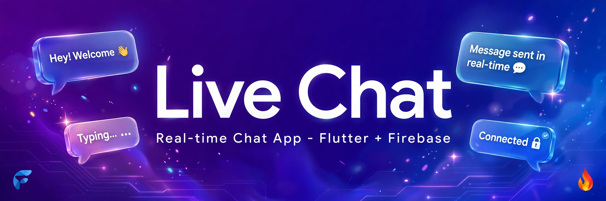

<div align="center">

# 💬 Live Chat

### Project #1 — Team Project


[](https://x.com/iamjideguru)

**A real-time chat application built with Flutter and Firebase**



</div>

---

## 📌 About / সম্পর্কে

**English:**
Live Chat is a team-built mobile app using **Flutter** and **Firebase**. Users can **create an account** and start chatting with other people in real time — just like Messenger and other social platforms.

**বাংলা:**
লাইভ চ্যাট একটি টিম প্রজেক্ট, **Flutter** ও **Firebase** দিয়ে তৈরি। ইউজাররা **অ্যাকাউন্ট খুলে** অন্যদের সাথে রিয়েল টাইমে চ্যাট করতে পারবে — ঠিক Messenger বা অন্যান্য সোশ্যাল প্ল্যাটফর্মের মতো।

---

## ✨ Features / ফিচারসমূহ

**English**
- 👤 User registration & login (Firebase Authentication)
- 💬 Real-time one-to-one chat (Cloud Firestore)
- 👥 Add contacts / friends like Messenger
- 🟢 Online / offline status
- ✍️ Typing indicator & message seen status
- 🖼️ Profile with photo upload (Firebase Storage)
- 🔔 Push notifications (Firebase Cloud Messaging)

**বাংলা**
- 👤 ইউজার রেজিস্ট্রেশন ও লগইন (Firebase Authentication)
- 💬 রিয়েল টাইম ওয়ান-টু-ওয়ান চ্যাট (Cloud Firestore)
- 👥 Messenger-এর মতো কন্টাক্ট / ফ্রেন্ড যোগ করা
- 🟢 অনলাইন / অফলাইন স্ট্যাটাস
- ✍️ টাইপিং ইন্ডিকেটর ও মেসেজ সিন স্ট্যাটাস
- 🖼️ ছবিসহ প্রোফাইল (Firebase Storage)
- 🔔 পুশ নোটিফিকেশন (Firebase Cloud Messaging)

---

## 📝 Form Design / ফর্ম ডিজাইন

### 1. Sign Up Form / সাইন আপ ফর্ম

```
        💬 Live Chat
─────────────────────────────
  [      Full Name        ]
  [        Email          ]
  [       Password     👁 ]
  [   Confirm Password   ]
  [   Create Account     ]
  Already have an account?
           Login
```

**English:**
- **Fields:** Full Name, Email, Password (minimum 6 characters), Confirm Password
- **Button:** Create Account
- **Link below:** *"Already have an account? Login"*

**বাংলা:**
- **ফিল্ড:** পুরো নাম, ইমেইল, পাসওয়ার্ড (কমপক্ষে ৬ অক্ষর), পাসওয়ার্ড নিশ্চিত করুন
- **বোতাম:** অ্যাকাউন্ট তৈরি করুন
- **নিচের লিংক:** *"অ্যাকাউন্ট আছে? লগইন করুন"*

### 2. Login Form / লগইন ফর্ম

```
        💬 Live Chat
─────────────────────────────
  [        Email          ]
  [       Password     👁 ]
  [        Login          ]
      Forgot password?
  Don't have an account?
          Sign up
```

**English:**
- **Fields:** Email, Password
- **Button:** Login
- **Links:** *"Forgot password?"* and *"Don't have an account? Sign up"*

**বাংলা:**
- **ফিল্ড:** ইমেইল, পাসওয়ার্ড
- **বোতাম:** লগইন
- **লিংক:** *"পাসওয়ার্ড ভুলে গেছেন?"* ও *"অ্যাকাউন্ট নেই? সাইন আপ করুন"*

### 🎨 Form Design Rules / ফর্ম ডিজাইন নিয়ম

**English**
- Rounded input fields (border radius 12)
- Clear label or hint text on every field
- Show / hide password toggle 👁
- Red error message under invalid fields
- Loading spinner on the button while signing in / up
- Same style on both forms — keep it consistent

**বাংলা**
- গোলাকার ইনপুট ফিল্ড (border radius 12)
- প্রতিটি ফিল্ডে স্পষ্ট লেবেল বা hint text
- পাসওয়ার্ড দেখা / লুকানোর টগল 👁
- ভুল ফিল্ডের নিচে লাল রঙের এরর মেসেজ
- সাইন ইন / আপের সময় বোতামে লোডিং স্পিনার
- দুই ফর্মে একই স্টাইল রাখুন — সামঞ্জস্য বজায় রাখুন

---

## 🛠️ Tech Stack / প্রযুক্তি

| Technology | Purpose / উদ্দেশ্য |
|---|---|
| Flutter (Dart) | Mobile app UI / মোবাইল অ্যাপ UI |
| Firebase Auth | User accounts / ইউজার অ্যাকাউন্ট |
| Cloud Firestore | Real-time database / রিয়েল টাইম ডাটাবেজ |
| Firebase Storage | Profile photos & media / প্রোফাইল ছবি ও মিডিয়া |
| Firebase Cloud Messaging | Push notifications / পুশ নোটিফিকেশন |

### 📦 Plugins / প্লাগইনসমূহ

Add these to `pubspec.yaml` / `pubspec.yaml`-এ এগুলো যোগ করুন:

```yaml
dependencies:
  cupertino_icons: ^2.0.0
  get: ^4.7.3
  firebase_core: ^4.15.0
  firebase_auth: ^6.7.0
  cloud_firestore: ^6.10.0
  google_fonts: ^9.0.0
  uuid: ^4.6.0
```

---

## 🚀 Getting Started / শুরু করুন

```bash
# Clone the repo / রেপো ক্লোন করুন
git clone <repo-url>
cd live-chat

# Install dependencies / ডিপেন্ডেন্সি ইনস্টল করুন
flutter pub get

# Run the app / অ্যাপ চালান
flutter run
```

> ⚠️ Add your own `google-services.json` (Android) / `GoogleService-Info.plist` (iOS) from your Firebase project.
> ⚠️ নিজের Firebase প্রজেক্ট থেকে `google-services.json` / `GoogleService-Info.plist` যোগ করুন।

---

## 🔄 Git Guide: Push & Sync / গিট গাইড: পুশ ও সিঙ্ক

### How to Push / পুশ করবেন কীভাবে

```bash
# 1. See changed files / পরিবর্তিত ফাইল দেখুন
git status

# 2. Add your changes / পরিবর্তন যোগ করুন
git add .

# 3. Commit with a clear message / স্পষ্ট মেসেজ দিয়ে কমিট করুন
git commit -m "Add login form UI"

# 4. Push to your branch / আপনার branch-এ পুশ করুন
git push origin your-branch-name
```

### Sync Latest with Old / পুরনোটার সাথে নতুনটা সিঙ্ক করুন

```bash
# 1. Go to main and get the latest / main-এ গিয়ে নতুনটা নিন
git checkout main
git pull origin main

# 2. Go back to your branch / আপনার branch-এ ফিরে যান
git checkout your-branch-name

# 3. Merge the latest main into your branch /
#    নতুন main আপনার branch-এর সাথে মার্জ করুন
git merge main

# 4. Fix conflicts if any, then push /
#    কনফ্লিক্ট থাকলে ঠিক করে পুশ করুন
git push origin your-branch-name
```

**English**
- Always pull before you start working.
- Never push directly to `main` — use your own branch.
- Fix merge conflicts yourself before pushing.

**বাংলা**
- কাজ শুরুর আগে সবসময় pull করে নিন।
- সরাসরি `main`-এ push করবেন না — নিজের branch ব্যবহার করুন।
- পুশ করার আগে merge conflict নিজে ঠিক করুন।

---

## 🤝 Contributors / অবদানকারীগণ

| Contributor | Role | GitHub |
|---|---|---|
| **rafsanrakibdskm75** |  👑 Main Owner / Team Lead | [@rafsanrakibdskm75](https://github.com/rafsanrakibdskm75) |
> Add every team member above / উপরে প্রতিটি টিম মেম্বারকে যোগ করুন।

---

## 📜 Project Rules / প্রজেক্ট নিয়মাবলি

> ⚠️ **These rules can be updated at any time. / এই নিয়মাবলি যেকোনো সময় আপডেট হতে পারে।**

**English**
1. 🚫 **No AI for coding or design.** All code and UI must be written by the team members themselves.
2. ✅ **AI may be used only for learning** — understanding concepts, reading documentation, understanding errors — but you must **implement everything yourself**.
3. 🚫 Do **not** copy-paste AI-generated code, not even partially.
4. 🔀 Use branches for your work. Do not push broken code directly to `main`.
5. ✍️ Write clear, meaningful commit messages.
6. 📢 Keep the team updated on your progress regularly.
7. 🤝 Respect deadlines and respect each other.
8. ⚖️ Rule violations will be decided by the team lead.

**বাংলা**
1. 🚫 **কোডিং বা ডিজাইনে AI ব্যবহার সম্পূর্ণ নিষেধ।** সব কোড ও UI টিম মেম্বারদের নিজেদের লিখতে হবে।
2. ✅ **AI শুধু শেখার জন্য ব্যবহার করা যাবে** — কনসেপ্ট বোঝা, ডকুমেন্টেশন পড়া, এরর বোঝা — কিন্তু ইমপ্লিমেন্টেশন **নিজেকেই করতে হবে**।
3. 🚫 AI দিয়ে তৈরি কোড কপি-পেস্ট করা যাবে না — আংশিকও না।
4. 🔀 নিজের কাজের জন্য branch ব্যবহার করুন। ভাঙা কোড সরাসরি `main`-এ push করবেন না।
5. ✍️ স্পষ্ট ও অর্থবহ commit message লিখুন।
6. 📢 নিয়মিত টিমকে নিজের অগ্রগতি জানান।
7. 🤝 ডেডলাইন মেনে চলুন এবং একে অপরকে সম্মান করুন।
8. ⚖️ নিয়ম ভঙ্গের বিষয়ে সিদ্ধান্ত নেবেন টিম লিড।

---

⭐ If you like this project, give it a star!
⭐ প্রজেক্টটি ভালো লাগলে একটি স্টার দিন!
